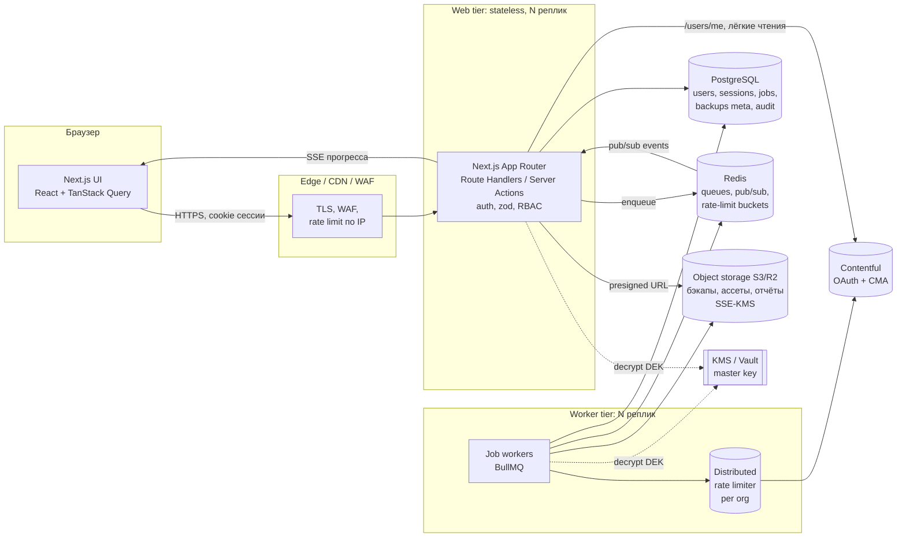
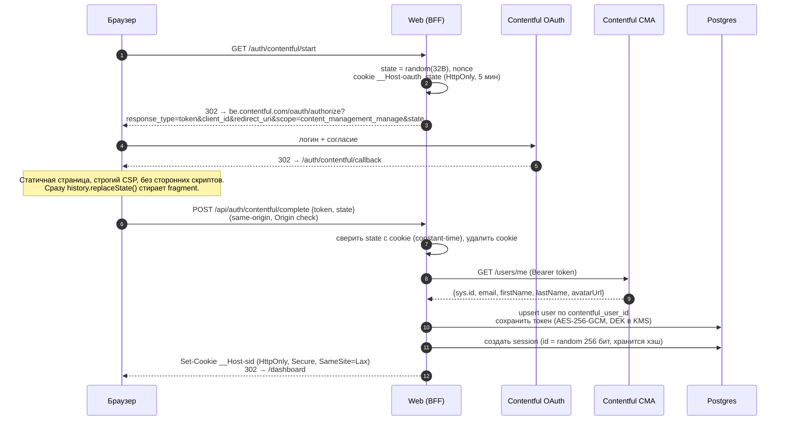
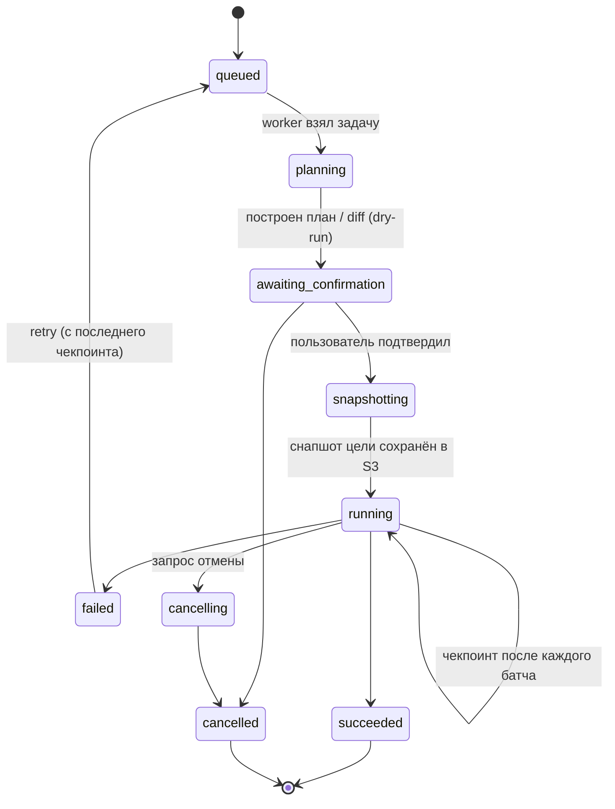
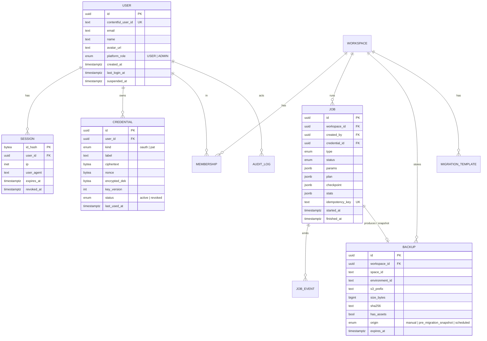

# Contentful Migration Tool: анализ и целевая архитектура

> Статус: **этапы 0–4 реализованы в версии 2.0** (см. раздел 0). Разделы 2–5 сохранены как исходный анализ и целевая картина, от которой отталкивалась реализация.

---

## 0. Что реализовано в версии 2.0

| Область | Реализация | Где в коде |
|---|---|---|
| Вход | Contentful OAuth (implicit grant + `state`) и вход по personal access token. Clerk удалён. Существующие аккаунты связываются по email | `src/server/auth/*`, `src/pages/api/auth/*`, `src/pages/sign-in.tsx`, `src/pages/auth/callback.tsx` |
| Сессии | Своя таблица `Session`: в БД хранится только sha256 секрета, cookie `__Host-` (HttpOnly, Secure, SameSite=Lax), скользящий срок плюс абсолютный лимит 30 дней, «выйти на других устройствах», отзыв при блокировке | `src/server/auth/session.ts`, `api/auth/sessions.ts` |
| Секреты | AES-256-GCM с key id и AAD (`token:<userId>`), ротация ключа без простоя, чтение старого AES-CBC формата, скрипт перешифровки | `src/lib/encryption.ts`, `scripts/rotate-secrets.ts` |
| API | Единый конвейер: метод → сессия → роль → rate limit (Redis) → zod → обработчик → единый формат ошибок без внутренних деталей | `src/server/api.ts` |
| Фоновые задачи | BullMQ и отдельный процесс-воркер. События задач в Redis Streams, SSE с `Last-Event-ID`. Отмена, лимит 3 активных задачи на пользователя, блокировка «одна изменяющая задача на окружение», упавшая задача не перезапускается вслепую | `src/server/jobs/*`, `src/worker/index.ts` |
| Безопасность продакшена | Перед каждой изменяющей операцией (restore, smart migration, live transfer, visual migration) обязателен страховочный бэкап цели. Если бэкап не удался, операция не начинается | `src/server/jobs/handlers/shared.ts` |
| Contentful API | Библиотеки `contentful-export` / `-import` / `-migration` вместо запуска CLI, токен не попадает в argv. Общий для всех процессов rate limiter в Redis (по пространству) плюс ретраи SDK | `src/server/contentful/client.ts` |
| Хранилище | Бэкапы хранятся gzip-файлами в `DATA_DIR/backups/<userId>/`, архивы ассетов стримятся (archiver). Все пути проходят через `resolveInside`, старые бэкапы из БД читаются прозрачно | `src/server/storage.ts`, `src/utils/backup-service.ts` |
| Visual Builder | Серверный allow-list шагов (zod), полное экранирование в генераторе кода, пользовательский JS на сервере не исполняется | `src/server/visual-migration.ts`, `src/utils/code-generator.ts` |
| Веб-безопасность | CSRF-проверка `Origin`/`Sec-Fetch-Site`, строгий CSP, HSTS, `X-Frame-Options`, без `CORS *`, лимиты тел запросов, проверка magic bytes у скриншотов | `src/middleware.ts`, `next.config.mjs` |
| Развёртывание | Один образ (web / worker / migrate), Node 22, non-root, read-only rootfs. Compose со встроенными Caddy (auto-HTTPS), Postgres, Redis (AOF) и ежедневным `pg_dump` | `Dockerfile`, `docker-compose.prod.yml`, `deploy/`, `docs/DEPLOYMENT.md` |
| Качество | 301 тест: безопасность API, IDOR, сессии, вход, задачи, инъекции в генератор, UI. CI: lint, typecheck, тесты, синхронизация схемы БД и миграций, build, `npm audit`, сборка Docker | `src/server/__tests__`, `.github/workflows/ci.yml` |

**Отличия от целевой картины ниже** (осознанные решения для развёртывания на одном сервере):
- Pages Router сохранён: переход на App Router означал бы переписать весь UI без выигрыша в безопасности и надёжности.
- Вместо S3 используется общий том `DATA_DIR`. Модуль `storage.ts` изолирует доступ к файлам, поэтому S3-драйвер добавляется без изменений в бизнес-логике.
- Вместо KMS используется ключ из секрета окружения с key id и ротацией. На одном VPS это стандартная практика, KMS имеет смысл при переходе в облако.
- Живые события задач хранятся в Redis Streams (24 часа), итог и хвост лога хранятся в `Job` в Postgres. Отдельная таблица `JobEvent` не понадобилась.
- Чекпоинты и возобновление задачи с места остановки не реализованы. Вместо них действует правило «аварийно прерванная задача помечается FAILED, откат делается из страховочного бэкапа». Это безопаснее, чем автоматический повтор частично применённой миграции.

**Следующие шаги (не сделано):** чекпоинты для очень больших переносов, S3-драйвер хранилища, OpenTelemetry/Sentry, команды (workspaces), плановые бэкапы по расписанию, Contentful App Framework.

---

## 1. Идея продукта

Веб-сервис для команд, которые работают с Contentful и которым нужно безопасно переносить контент и модели между окружениями и пространствами. Встроенные средства Contentful (CLI, merge app) требуют терминала и хорошего понимания API.

Ключевые сценарии (по текущему коду):

| Сценарий | Что делает | Где сейчас |
|---|---|---|
| **Backup** | Полный экспорт окружения (content types, entries, assets, locales, editor interfaces), опционально с файлами ассетов | `pages/api/backup.ts`, `utils/contentful-cli.ts` |
| **Restore** | Импорт бэкапа в окружение, полный или выборочный (типы контента, локали, маппинг локалей) | `restore.ts`, `selective-restore.ts`, `smart-restore/*` |
| **Smart Migration** | Сравнение двух окружений (diff моделей и записей) и перенос выбранного с учётом зависимостей | `smart-migrate/*`, `utils/dependency-resolver.ts` |
| **Live Transfer** | Прямой перенос через CMA между пространствами и окружениями без промежуточных файлов | `smart-restore/live-transfer*.ts` |
| **Visual Builder** | Конструктор миграций моделей контента без кода, шаблоны | `visual-migrate*.ts`, `utils/code-generator.ts` |
| **Views migration** | Перенос сохранённых views/editor interfaces | `migrate-views.ts` |
| **Admin** | Пользователи, роли, логи, настройки лимитов, тикеты поддержки | `pages/api/admin/*` |

Ценность продукта: **безопасность изменений в чужом продакшене**. Поэтому надёжность, аудит и защита токенов важнее, чем количество функций.

---

## 2. Аудит текущей реализации

### 2.1. Критичные уязвимости (исправить до любого публичного запуска)

| # | Проблема | Где | Последствие |
|---|---|---|---|
| C1 | **Инъекция JS-кода в генератор миграций.** `ctId`, `fieldId`, `name`, `contentType` вставляются в строку `'${...}'` без экранирования, затем файл исполняется CLI на сервере | `utils/code-generator.ts:51,91,111,255,258`, `pages/api/visual-migrate.ts` | **RCE**: любой пользователь выполняет код на сервере и получает доступ к БД, ключу шифрования и токенам всех пользователей |
| C2 | **Произвольная запись файла.** `spaceId` и `fileName` из тела запроса без проверки попадают в `path.join` | `pages/api/save-temp-backup.ts:44` | Запись в любой каталог (`../../.next/server/...`), фактически RCE |
| C3 | **Path traversal и чужие файлы.** Файлы лежат в `backups/<spaceId>/` без привязки к пользователю, а `spaceId` и `fileName` приходят от клиента | `download-transient-zip.ts:26`, `contentful-cli.ts` (`restoreBackup`), `custom-migrate.ts` (`selectiveBackupFile`) | Чтение и импорт чужих бэкапов, выход за пределы каталога |
| C4 | **IDOR: переименование чужого токена.** В ветке `rename` нет проверки владельца | `pages/api/user/tokens.ts:71` | Любой может изменить чужую запись, а ответ возвращает объект целиком, включая зашифрованный токен |
| C5 | **Ключ шифрования = `CLERK_SECRET_KEY`**, есть hardcoded fallback, режим AES-CBC без аутентификации | `lib/encryption.ts:3` | Утечка одного секрета раскрывает все токены. Без MAC нет защиты от подмены шифротекста. Ротация ключа невозможна |
| C6 | **CMA-токен в аргументах процесса** (`--management-token`) | `contentful-cli.ts:90,154`, `visual-migrate.ts:71` | Токен виден в `ps`, `/proc/*/cmdline` и логах оркестратора |
| C7 | **`Access-Control-Allow-Origin: *`** на всех `/api/*` | `next.config.mjs:81` | Лишняя поверхность атаки. Вместе с cookie-сессиями это путь к CSRF-подобным сценариям |
| C8 | **OAuth callback отдаёт токен через `postMessage(..., '*')` и `?token=` в URL** | `pages/api/contentful-callback.ts:60` | Токен уходит в любое окно-opener, а также в историю браузера, логи и Referer |
| C9 | **`admin/error-log` GET без проверки роли** | `pages/api/admin/error-log.ts:25` | Любой пользователь читает логи ошибок, в которых есть данные других пользователей |
| C10 | **`middlewareClientMaxBodySize: 5 GB`, `bodyParser 1gb`** | `next.config.mjs:16`, `selective-restore.ts` | Простой DoS: память процесса заканчивается несколькими запросами |

### 2.2. Архитектурные проблемы

1. **Тяжёлые операции выполняются внутри HTTP-запроса.** Бэкап, restore и live transfer длятся минутами и часами в обработчике Next.js API, прогресс идёт через SSE того же запроса. Обрыв соединения, деплой или таймаут прокси прерывают миграцию на середине, и продакшен-окружение остаётся в частично изменённом состоянии. Возобновить операцию нельзя.
2. **Состояние на локальном диске** (`backups/`, `.auth-cache.json`, `~/.contentfulrc.json`, `os.tmpdir()`). Горизонтально масштабировать нельзя: второй инстанс не видит файлов первого. Контейнер без volume теряет данные.
3. **Бэкапы хранятся как `Json` в PostgreSQL** (`BackupRecord.content`). Бэкап среднего пространства весит десятки и сотни МБ. Это раздувает БД, WAL и бэкапы самой БД, а каждое чтение целиком загружает объект в память.
4. **Запуск `npx contentful ...` через `spawn`.** Каждая операция поднимает новый Node-процесс (~100–300 МБ), успех определяется парсингом stdout регулярками, контроля над ретраями и rate limit нет, в Docker CLI дополнительно ставится глобально.
5. **Rate limit реализован как `sleep(150)`** в каждом цикле. Лимит CMA общий для организации (по умолчанию ~7 rps). Два параллельных пользователя одной организации мешают друг другу и получают 429, а при 429 нет корректного backoff по `X-Contentful-RateLimit-Reset`.
6. **Дублирование логики.** `live-transfer.ts` и `live-transfer-stream.ts`, `live-migrate-stream.ts` содержат почти одинаковый код, есть legacy-ветки (`User.contentfulToken` и `ContentfulToken`, `externalId`, `.snippet`-файл), заглушки (`contentful-auth.ts`, `import-status.ts` → 501).
7. **Нет единого слоя авторизации и валидации.** Каждый обработчик сам вызывает `getAuth`, ищет пользователя и проверяет роль. Zod подключён, но почти не используется на входе API. Ошибки отдаются клиенту сырыми (`error.message`), в том числе внутренние.
8. **Двойная аутентификация.** Clerk для входа плюс вручную вставленный CMA-токен. Пользователь дважды регистрируется и сам копирует токен из Contentful: это самый неудобный шаг онбординга и самый опасный (токены живут вечно, их пересылают в мессенджерах).
9. **Роли и лимиты в строковых полях** (`role: String`, `status: String`), нет enum и аудита действий администратора.
10. **Инфраструктура:** Node 18 (EOL), `docker-compose` с дефолтным паролем и открытым портом 5432, миграции БД при старте контейнера (гонка при нескольких репликах), README расходится с кодом (Next 14 App Router против Next 15 Pages Router).

### 2.3. Что стоит сохранить

- Доменная логика, в которой уже есть экспертиза: `dependency-resolver.ts`, `locale-filter.ts`, `entry-helpers.ts`, `restore-helpers.ts`, `backup-validator.ts`, diff окружений. Её нужно вынести в чистый пакет и покрыть тестами.
- UI-стек: shadcn/ui, Tailwind, TanStack Query, react-hook-form и zod. Выбор современный.
- Идея автоматического бэкапа целевого окружения перед мутацией: сделать её обязательной и неотключаемой для продакшена.
- Существующие тесты как основа для регрессии.

---

## 3. Целевая архитектура

### 3.1. Принципы

1. **Токен пользователя никогда не попадает в браузер** после входа, в логи, в аргументы процессов и в ответы API.
2. **Всё долгое выполняется в фоновых задачах (jobs).** HTTP только ставит задачу и читает её статус. Задачи идемпотентны, возобновляемы и переживают деплой.
3. **Stateless-приложение.** Всё состояние хранится в PostgreSQL, Redis и объектном хранилище, поэтому любой инстанс можно убить и добавить.
4. **Сервер не исполняет пользовательский код.** Миграции описываются декларативным DSL (JSON) и исполняются через API библиотеки, без генерации строк JS.
5. **Default deny.** Каждый endpoint явно объявляет схему входа (zod), требуемую роль и ресурс-владельца.
6. **Безопасность продакшена по умолчанию:** dry-run → diff → явное подтверждение → авто-снапшот цели → выполнение → отчёт и возможность отката.

### 3.2. Общая схема



### 3.3. Технологический стек

| Слой | Выбор | Почему |
|---|---|---|
| Runtime | **Node.js 24 LTS**, TypeScript strict | Актуальная LTS |
| Монорепо | **pnpm workspaces + Turborepo** | Web и worker используют общий домен и схемы |
| Web | **Next.js (App Router)**, Route Handlers и Server Actions, RSC | Один деплой для UI и BFF, серверные компоненты для чтения данных |
| UI | shadcn/ui, Tailwind, TanStack Query, react-hook-form, zod | Остаётся без изменений |
| Очереди | **BullMQ + Redis** | Ретраи, backoff, приоритеты, групповой rate limit, повтор задачи, UI (bull-board) |
| БД | **PostgreSQL 16+**, **Drizzle ORM** (или Prisma 6) | Типобезопасные миграции. Prisma можно оставить, если не хочется переписывать слой данных |
| Хранилище | **S3-совместимое** (AWS S3 / Cloudflare R2 / MinIO локально) | Бэкапы и ассеты вне БД, presigned upload и download, lifecycle-политики |
| Contentful | **`contentful-management` SDK**, `contentful-export` / `contentful-import` / `contentful-migration` **как библиотеки** | Без `spawn`, с контролем ретраев, без токена в argv |
| Секреты | **KMS** (AWS KMS / GCP KMS) или **HashiCorp Vault Transit** | Envelope encryption и ротация |
| Наблюдаемость | **OpenTelemetry**, pino (JSON-логи с redaction), Sentry, Prometheus/Grafana | Трассировка запрос → job → вызовы CMA |
| Тесты | Vitest (unit), Playwright (e2e), MSW / nock для CMA | Быстрее Jest, e2e для критических потоков |

### 3.4. Структура репозитория

```
apps/
  web/                 Next.js: UI + BFF (route handlers)
    app/(auth)/        вход через Contentful, callback
    app/(app)/         дашборд, backups, migrate, restore, builder
    app/(admin)/       админка
    app/api/           тонкие handlers: validate → authorize → service
  worker/              процесс(ы) BullMQ, по очереди на тип задач
packages/
  core/                чистый домен без I/O: diff, dependency graph, locale mapping,
                       валидация бэкапа, планировщик шагов миграции, DSL Visual Builder
  contentful/          обёртка над CMA: rate limiter, ретраи, пагинация, стриминг,
                       типизированные ошибки
  db/                  схема, миграции, репозитории
  auth/                сессии, OAuth-клиент Contentful, RBAC-политики
  crypto/              envelope encryption (AES-256-GCM + KMS)
  shared/              zod-схемы API и событий jobs (общие для web, worker и UI)
  config/              валидация env через zod при старте (fail fast)
infra/
  docker/, compose.dev.yml, terraform/ | helm/
```

### 3.5. Аутентификация: вход через Contentful OAuth

Цель: **один клик «Войти через Contentful»** вместо регистрации в Clerk плюс ручного копирования токена. Clerk полностью убирается.

Contentful поддерживает OAuth 2.0 для сторонних приложений: приложение регистрируется в Contentful (Organization settings → OAuth applications), пользователь подтверждает доступ, токен возвращается в **URI fragment** (implicit grant). Scope: `content_management_manage`; за один запрос передаётся только один scope.

#### Поток



#### Детали и решения

- **Идентичность пользователя:** `contentful_user_id` (из `/users/me`) является первичным внешним ключом. Email не уникальный ключ, а атрибут (email могут сменить).
- **Сессии свои, не JWT:** случайный id, в БД хранится `sha256(id)`, скользящий срок жизни 7 дней, абсолютный 30 дней, ротация id при входе, отзыв из профиля («выйти на всех устройствах»). Cookie `__Host-` без `Domain`, `SameSite=Lax`. На мутирующих запросах проверяются `Origin` / `Sec-Fetch-Site` плюс double-submit CSRF-токен для Server Actions и форм.
- **Токен Contentful** хранится только на сервере и расшифровывается только в момент вызова CMA внутри worker/BFF. При каждом входе токен обновляется. Если CMA отвечает 401, соединение помечается `revoked` и пользователю предлагается войти заново.
- **Ограничение OAuth-токена:** он имеет права пользователя во всех его организациях. Это нужно явно показать на экране согласия. Для компаний с жёсткой политикой оставляется **опциональное подключение Personal Access Token** с ограниченными правами (или токена отдельного сервисного пользователя). Он хранится так же, как `CredentialConnection` с типом `pat`.
- **Выход:** удаление сессии; по опции «отключить Contentful» токен удаляется из БД, и пользователю показывается ссылка на страницу отзыва OAuth-токенов в его профиле Contentful.
- **Первый администратор** назначается через env `BOOTSTRAP_ADMIN_CONTENTFUL_IDS` при первом входе, а не скриптом, который правит БД вручную.
- **Команды (на будущее):** модель `Workspace` → `Membership(role)` позволяет нескольким людям видеть общие бэкапы и историю операций по пространству.

> Альтернатива на следующий этап: **Contentful App Framework**. Приложение устанавливается прямо в Contentful, работает внутри его UI и вызывает CMA по App Identity (подписанные запросы, короткоживущие app access tokens) без хранения пользовательских токенов. Это самый безопасный вариант, но он требует установки приложения в каждое пространство и ограничивает кросс-организационные сценарии. Разумно сделать это вторым каналом поверх того же `packages/core`.

### 3.6. Шифрование секретов

- **Envelope encryption:** на каждую запись генерируется DEK (AES-256-**GCM**, 96-битный nonce, AAD = `userId|connectionId`). DEK шифруется master key в KMS/Vault. В БД хранятся `ciphertext`, `nonce`, `tag`, `encrypted_dek`, `key_version`.
- **Ротация master key** выполняется без перешифровки данных (перешифровываются только DEK), фоновой задачей.
- Ключ шифрования отделён от всех остальных секретов. При отсутствии обязательных секретов приложение **не стартует** (zod-валидация env), fallback-значений нет.
- Бэкапы в S3 шифруются SSE-KMS, бакет приватный, доступ только по presigned URL с коротким TTL (5 мин), ключ объекта содержит `workspaceId/userId`, а не данные от клиента.

### 3.7. Модель задач (jobs): основа масштабируемости

Все операции (`backup`, `restore`, `migrate`, `live_transfer`, `visual_migration`, `diff`) проходят один конвейер:



- **API:** `POST /api/jobs` (тип + zod-валидированные параметры + `Idempotency-Key`) → `202 {jobId}`. `GET /api/jobs/:id` отдаёт статус. `GET /api/jobs/:id/events` отдаёт SSE с поддержкой `Last-Event-ID`: переподключение без потери событий. `POST /api/jobs/:id/cancel`.
- **Прогресс:** worker пишет события в `job_events` (Postgres, для истории и отчётов) и публикует их в Redis pub/sub (для живого стрима). Любая реплика web может отдать стрим любой задачи.
- **Чекпоинты:** план миграции является упорядоченным списком шагов (content types → locales → assets → entries в топологическом порядке → publish). После каждого батча в БД фиксируется номер шага и маппинг `sourceId → targetId`/версия. Повтор продолжает с чекпоинта, а операции идемпотентны (upsert по id с проверкой `sys.version`).
- **Изоляция:** отдельные очереди по типам (`export`, `import`, `diff`, `light`), чтобы тяжёлые экспорты не блокировали быстрые diff. Concurrency на worker и **лимит активных задач на пользователя и на организацию** (например, 2 и 3).
- **Graceful shutdown:** на SIGTERM worker дописывает текущий батч, сохраняет чекпоинт и возвращает задачу в очередь. Деплой миграции не ломает.
- **Блокировка цели:** одна мутирующая задача на `(spaceId, environmentId)` одновременно (advisory lock или Redis lock с fencing token), чтобы две миграции не писали в одно окружение.

### 3.8. Работа с Contentful API под нагрузкой

- **Распределённый rate limiter** (token bucket в Redis, Lua-скрипт) с ключом по **организации Contentful** (лимит CMA считается на организацию и по умолчанию около 7 rps, на enterprise-планах выше). Все workers всех пользователей одной организации делят один бюджет. Лимит конфигурируется, а фактический читается из заголовков `X-Contentful-RateLimit-*`.
- **429 / 5xx:** ретраи с экспоненциальным backoff и jitter, учётом `X-Contentful-RateLimit-Reset` и circuit breaker на организацию.
- **Стриминг вместо загрузки в память:** экспорт постранично (`limit=1000`, cursor/skip) пишется потоком в S3 как **NDJSON** (по файлу на тип сущности) с multipart upload. Импорт читает потоково. Память worker не зависит от размера пространства.
- **Ассеты:** файлы передаются потоком CDN Contentful → S3 (или напрямую upload URL целевого пространства) без сохранения на диск, с ограничением параллелизма и размера (`maxAssetSizeMB`).
- **Кэш метаданных** (spaces, environments, content types, locales) в Redis с TTL 60 с и инвалидацией после мутаций. Это сильно снижает число вызовов CMA от UI.

### 3.9. Visual Builder без исполнения кода

- Шаги хранятся как **строго типизированный DSL** (discriminated union в zod): `createContentType`, `createField`, `changeFieldType`, `transformEntries` (из фиксированного набора трансформаций) и т. п.
- Все идентификаторы валидируются регуляркой Contentful (`^[a-zA-Z0-9_-]{1,64}$`, для полей `^[a-zA-Z][a-zA-Z0-9_]*$`), строки ограничены по длине.
- Исполнение идёт через **`contentful-migration` как библиотеку** (`runMigration({ migrationFunction })`): функция строится интерпретатором DSL в памяти вызовами API (`migration.createContentType(id).name(name)`), **без генерации и eval строки кода**.
- «Экспорт в код» остаётся как функция скачивания: сгенерированный JS для запуска у себя в CI (генерация через безопасную сериализацию `JSON.stringify` для каждого литерала).
- **Пользовательские произвольные скрипты** (`Script`) не исполняются на сервере. Если такая функция критична, её можно сделать только в изолированной песочнице (отдельный Firecracker/gVisor-контейнер без сети, кроме `api.contentful.com`, с короткоживущим токеном и лимитами CPU и памяти). Это отдельный продуктовый проект.

### 3.10. Модель данных (основные сущности)



Также нужны `JOB_EVENT` (append-only, партиционирование по месяцу), `AUDIT_LOG` (кто, что, над каким ресурсом, IP, результат; append-only), `APP_SETTINGS`, `SUPPORT_TICKET` (скриншоты в S3, а не base64 в теле запроса). Все статусы и роли задаются через enum. Все выборки идут через репозитории, которые **обязательно** принимают `workspaceId` / `userId`: это защита от IDOR на уровне слоя данных.

### 3.11. Слой API: единый конвейер запроса

Каждый handler строится одной обёрткой:

```ts
export const POST = route({
  auth: 'user',                       // 'public' | 'user' | 'admin'
  input: CreateJobSchema,             // zod: body + query
  rateLimit: { key: 'user', limit: 20, window: '1m' },
  handler: async ({ user, input, ctx }) => jobs.create(user, input, ctx),
});
```

Обёртка отвечает за:
- проверку сессии и роли;
- zod-валидацию (unknown-поля отбрасываются, лимиты на размеры);
- rate limit на пользователя и IP;
- корреляционный `requestId`;
- единый формат ошибок `{ error: { code, message } }` без стека и внутренних сообщений;
- запись в audit log для мутаций.

Прочие правила:
- **Загрузка бэкапа для restore:** presigned multipart upload напрямую в S3, затем валидация файла в worker (схема, размер, zip-slip при распаковке). Body parser Next.js остаётся с лимитом 1 МБ.
- **Скачивание:** `302` на presigned URL с `Content-Disposition`, имя файла санитизируется.
- **Заголовки:** строгий CSP (nonce-based), `Strict-Transport-Security`, `X-Content-Type-Options`, `Referrer-Policy: strict-origin-when-cross-origin`, `Permissions-Policy`, `frame-ancestors 'none'`. CORS отключён (same-origin).

### 3.12. Безопасность продакшен-окружений (продуктовые гарантии)

1. **Dry-run по умолчанию.** Любая мутация сначала строит план и diff: что создаётся, обновляется, удаляется и публикуется, с количеством и примерами.
2. **Для окружений `master` и алиасов** нужно вручную ввести имя окружения для подтверждения, а для админ-политики доступен второй подтверждающий (4-eyes).
3. **Обязательный снапшот цели** перед мутацией. Он хранится N дней, откат делается одной кнопкой (restore из снапшота как обычная задача).
4. **Проверка версий** (`sys.version`) при обновлении: если запись изменили после построения плана, будет конфликт, а не тихая перезапись.
5. **Отчёт по задаче:** JSON и HTML с полным списком изменённых id, ошибками и ссылками в Contentful.

### 3.13. Наблюдаемость и эксплуатация

- **Логи:** pino JSON, redaction путей `*.token`, `authorization`, `cookie`. Логи ошибок хранятся не в файлах на диске (`backups/logs`), а в `job_events` и централизованном хранилище логов.
- **Метрики:** длина очередей, время выполнения задач по типам, доля 429 по организациям, ошибки CMA, активные SSE-соединения.
- **Трассировка:** OpenTelemetry от HTTP-запроса до шагов job и каждого вызова CMA.
- **Health:** `/healthz` (liveness), `/readyz` (БД, Redis, S3). Worker отдаёт heartbeat.
- **Алерты:** рост failed jobs, circuit breaker открыт, очередь растёт дольше N минут.

### 3.14. Развёртывание

- Два образа из одного монорепо: `web` и `worker` (multi-stage, `node:24-slim` или distroless, non-root, read-only FS, без глобального contentful-cli).
- Миграции БД запускаются **отдельным шагом релиза** (job / init-container), а не в `CMD` каждой реплики.
- Managed PostgreSQL (с PITR), managed Redis, S3/R2, KMS. Секреты берутся из secret manager, а не из `.env` в образе.
- Автомасштабирование: `web` по CPU и RPS, `worker` по длине очереди (KEDA).
- Локальная разработка: `compose.dev.yml` с Postgres, Redis и MinIO без открытых наружу портов и с паролями из `.env`.
- **CI:** lint, typecheck, unit, e2e (Playwright против MSW-мока CMA), `pnpm audit`, CodeQL/Semgrep, сборка образов, сканирование Trivy.

### 3.15. Защита от злоупотреблений и лимиты

- Rate limit на IP (edge) и на пользователя (API), отдельные лимиты на создание задач.
- Квоты на workspace: число и суммарный объём бэкапов, срок хранения, число параллельных задач. Хранятся в `APP_SETTINGS` / тарифе, проверяются в одной транзакции с созданием задачи.
- Автоочистка просроченных бэкапов через S3 lifecycle и периодическую задачу, которая синхронизирует метаданные.

---

## 4. План перехода

Переписывать всё сразу не нужно. Порядок выбран так, чтобы сначала закрыть риски, а затем менять фундамент.

### Этап 0: срочные исправления в текущем коде (1–3 дня)
- [ ] C1: экранировать все литералы в `code-generator.ts` через `JSON.stringify` и валидировать id по регуляркам. На время исправления лучше отключить `visual-migrate`.
- [ ] C2, C3: удалить `save-temp-backup` или валидировать `spaceId` и `fileName` (`^[a-zA-Z0-9_-]+$`, `path.basename`, проверка `resolved.startsWith(base + path.sep)`). Привязать файлы к `userId`.
- [ ] C4: проверка владельца в `tokens.ts` (rename) и `select` без поля `token` в ответе.
- [ ] C5: отдельный `ENCRYPTION_KEY` (32 байта, base64), AES-256-GCM с версией формата, миграция старых записей, удаление fallback.
- [ ] C6: передавать токен только через env (`CONTENTFUL_MANAGEMENT_TOKEN`), убрать `--management-token` из argv.
- [ ] C7, C10: убрать CORS `*`, вернуть разумные лимиты тела запроса.
- [ ] C8, C9: удалить старый callback и `log-file.ts`, добавить проверку роли в `admin/error-log` GET.
- [ ] Node 22+/24, закрыть порт 5432 в compose, убрать дефолтные пароли.

### Этап 1: фундамент (1–2 недели)
- [ ] Монорепо (`apps/web`, `apps/worker`, `packages/*`), `packages/config` с валидацией env.
- [ ] `packages/core`: перенос доменной логики (diff, dependency resolver, locale filter, validator) и тесты.
- [ ] `packages/contentful`: клиент с распределённым rate limiter, ретраями и стримингом.
- [ ] Схема БД v2 и миграция данных из текущей схемы.

### Этап 2: вход через Contentful (≈1 неделя)
- [ ] Регистрация OAuth-приложения в Contentful, поток из п. 3.5, собственные сессии, CSRF.
- [ ] Миграция существующих пользователей: при первом входе через Contentful связать аккаунт по email с подтверждением. Ручные токены становятся `CREDENTIAL(kind=pat)`.
- [ ] Удаление Clerk.

### Этап 3: jobs и хранилище (2–3 недели)
- [ ] BullMQ, workers, `JOB` / `JOB_EVENT`, SSE с `Last-Event-ID`, отмена, чекпоинты.
- [ ] Бэкапы в S3 (NDJSON и ассеты), presigned upload и download, перенос существующих `BackupRecord.content` в S3.
- [ ] Перевод backup → restore → migrate → live transfer на единый конвейер plan → confirm → snapshot → run. Удаление дублей (`live-transfer` / `-stream`).
- [ ] Visual Builder на DSL и `runMigration` без генерации кода.

### Этап 4: эксплуатация и масштаб (1–2 недели)
- [ ] OpenTelemetry, Sentry, метрики и алерты, bull-board за admin-ролью.
- [ ] Нагрузочное тестирование (k6): 200 одновременных пользователей, 50 параллельных задач, пространство на 100k записей и 10 ГБ ассетов. Цель: стабильная память worker и ноль потерянных задач при рестарте.
- [ ] Security review / внешний pentest, политика хранения данных, страница «Security & Privacy».

### Этап 5 (опционально)
- [ ] Workspaces и команды, общие бэкапы, 4-eyes approvals.
- [ ] Плановые бэкапы (cron-задачи).
- [ ] Contentful App Framework как второй канал поверх `packages/core`.

---

## 5. Открытые вопросы

1. **Хостинг:** ~~Vercel плюс отдельный worker или Kubernetes/ECS?~~ Для версии 2.0 выбран один сервер с Docker Compose (см. `docs/DEPLOYMENT.md`). При росте нагрузки: managed Postgres и Redis, S3 и несколько воркеров.
2. **Мультиарендность:** нужны ли команды и организации в первой версии или достаточно личных аккаунтов?
3. **Пользовательские скрипты:** ~~оставить или заменить?~~ Исполнение пользовательского кода на сервере убрано. Custom-трансформации доступны только через скачивание скрипта.
4. **Срок хранения бэкапов** и лимиты для бесплатного и платного уровней.
5. **Совместимость:** нужно ли сохранять старые бэкапы из `BackupRecord.content` или достаточно одноразовой миграции в S3?
